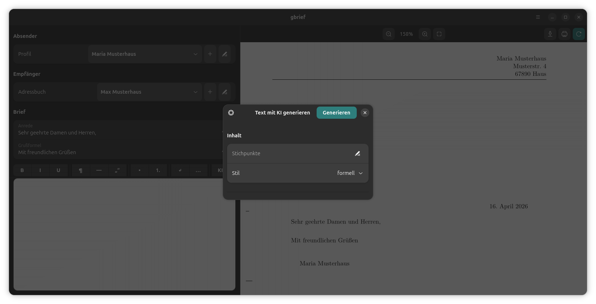

# gbrief – GNOME Briefschreiber

Professionelle Briefe im DIN-5008-Stil direkt am Desktop schreiben und als PDF exportieren. gbrief nutzt LaTeX (KOMA-Script `scrlttr2`) im Hintergrund und bietet eine moderne GTK4/Adwaita-Oberfläche.

gbrief greift die Idee von [tk-brief](https://github.com/ralfm/tk-brief) von Ralf Müller auf und setzt sie für den GNOME-Desktop neu um.



## Bedienung

Die Oberfläche ist zweigeteilt: links die Eingabe, rechts die Live-Vorschau des fertigen Briefes als PDF.

**Absender** – Oben links wählt man ein gespeichertes Absenderprofil (hier: *Maria Musterhaus*) aus dem Dropdown. Über die Schaltflächen daneben lassen sich Profile anlegen und bearbeiten, inklusive optionalem Firmenlogo.

**Empfänger** – Darunter wählt man den Empfänger aus dem Adressbuch (hier: *Max Musterhaus*). Auch hier können Einträge direkt hinzugefügt oder bearbeitet werden.

**Briefkopf** – Anrede und Grußformel sind vorausgefüllt (*Sehr geehrte Damen und Herren* / *Mit freundlichen Grüßen*) und lassen sich jederzeit anpassen.

**Texteditor** – Der große Bereich darunter nimmt den Brieftext auf. Die Formatierungsleiste bietet schnelle Eingabe von Fettdruck, Kursiv, Unterstrichen, Absätzen, Aufzählungen, Anführungszeichen und mehr – alles als LaTeX-Befehle. Der **KI**-Button öffnet den Dialog *Text mit KI generieren*: Stichpunkte eingeben, Stil wählen (formell, freundlich, sachlich …) und den fertigen Text per Klick auf *Generieren* erzeugen lassen. Dafür wird ein kostenloser Google Gemini API-Key benötigt, den man unter [aistudio.google.com](https://aistudio.google.com) erstellen kann. Beim ersten Klick auf *KI* wird der Key einmalig abgefragt und lokal gespeichert.

**PDF-Vorschau** – Rechts erscheint der fertige Brief in Echtzeit. Die Zoom-Steuerung in der Mitte der Toolbar passt die Ansicht an; Speichern, Drucken und manuelles Neu-Kompilieren sind als Schaltflächen oben rechts erreichbar.

## Features

- Absender-Verwaltung mit optionalem Firmenlogo
- Empfänger-Adressbuch mit Dropdown-Auswahl
- Live-Vorschau des fertigen Briefes als PDF
- KI-Textgenerierung via Google Gemini (optional, eigener API-Key)
- Formatierungsleiste für gängige LaTeX-Befehle
- Sitzungsspeicherung (letzter Zustand wird wiederhergestellt)
- Lokale Datenhaltung in `~/.local/share/gbrief/`

## Installation

### Debian/Ubuntu – fertiges Paket

Das `.deb`-Paket von der [Releases-Seite](https://github.com/x-ingo/gbrief/releases) herunterladen und installieren:

```bash
sudo dpkg -i gbrief_*.deb
sudo apt-get install -f   # fehlende Abhängigkeiten nachinstallieren
```

Danach ist gbrief im Anwendungsmenü unter **Büro** zu finden und per Terminal mit `gbrief` startbar.

### Aus dem Quellcode starten

**Voraussetzungen:**

```bash
sudo apt-get install \
  python3 python3-gi \
  gir1.2-gtk-4.0 gir1.2-adw-1 gir1.2-gtksource-5 gir1.2-poppler-0.18 \
  latexmk texlive-latex-recommended texlive-lang-german
```

**Starten:**

```bash
git clone https://github.com/x-ingo/gbrief.git
cd gbrief
python3 main.py
```

Beim ersten Start werden Icon und Desktop-Eintrag automatisch im Benutzerverzeichnis eingerichtet.

## Datenspeicherung

Alle Nutzerdaten liegen ausschließlich lokal:

| Datei | Inhalt |
|---|---|
| `~/.local/share/gbrief/gbrief.db` | Absender und Empfänger (SQLite) |
| `~/.local/share/gbrief/session.json` | Letzter Sitzungszustand |
| `~/.local/share/gbrief/config.json` | Optionaler Gemini API-Key |

## Technologie

- [GTK4](https://gtk.org/) + [Adwaita](https://gnome.pages.gitlab.gnome.org/libadwaita/) – UI-Framework
- [GtkSourceView 5](https://wiki.gnome.org/Projects/GtkSourceView) – Texteditor
- [Poppler](https://poppler.freedesktop.org/) – PDF-Vorschau
- [KOMA-Script scrlttr2](https://www.ctan.org/pkg/koma-script) – Briefsatz mit LaTeX
- [latexmk](https://ctan.org/pkg/latexmk) – LaTeX-Kompilierung

## Lizenz

[GPL v3](LICENSE) — Weiterentwicklungen müssen ebenfalls als Open Source veröffentlicht werden.
